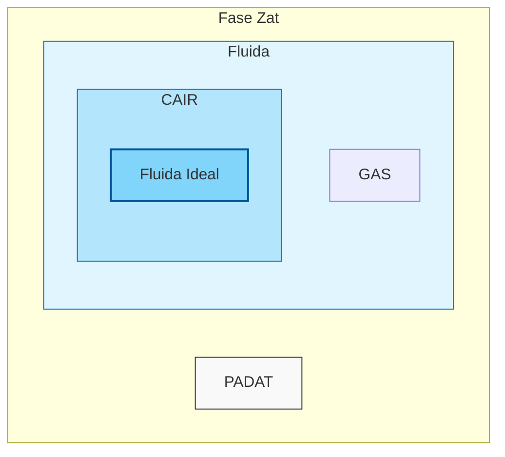

# Fluida Statis

## Pendahuluan
* Fluida merupakan semua fase dari suatu zat yang dapat **mengalir** atau dialirkan.
* Fluida dapat dikelompokkan menjadi 2 jenis berdasarkan sifatnya yaitu **fluida ideal** dan fluida real.
* Ciri-ciri dari fluida yang dianggap ideal adalah:
  1. Tidak memiliki viskositas ($\eta$)
  2. Tidak dapat ditekan (volumen tetap meskipun ditekan)
  3. Aliran yang diciptakan bersifat indah (laminar)

* Berdasarkan gambar di atas, diketahui bahwa fluida ideal hanya dapat terjadi pada fase cair dan tidak semua benda cair adalah fluida ideal!
* **Fluida statis** itu sendiri adalah cabang materi fluida yang secara khusus membahas kondisi fluida yang sedang diam.

## Tekanan
* Secara **umum**, tekanan ($P$ dengan satuan $\text{Pa}$) adalah perbandingan antara gaya yang menekan suatu bidang ($F$ dengan satuan $\text{N}$) dengan luas bidang itu sendiri ($A$ dengan satuan $\text{m}^2$).

    
    
<b>Gambar 1:</b> Visualisasi Tekanan pada Sebuah Bidang

* Pada fluida, terdapat jenis tekanan yang spesifik menekan suatu benda yang sedang berada di dalam fluida yaitu **tekanan hidrostatis** ($P_h$). Tekanan hidrostatis dirumuskan sebagai berikut:

$$
P_h = \rho_{fluida} \times g \times h
$$

$\rho_{fluida}$ : massa jenis fluida [$\text{kg/m}^3$]
$g$ : percepatan gravitasi [$\text{m/s}^2$]
$h$ : kedalaman benda dari permukaan fluida [$\text{m}$]

    
    
<b>Gambar 2:</b> Visualisasi Tekanan Hidrostatis

* Pahami hal-hal yang mempengaruhi nilai tekanan hidrostatis (selain massa jenis fluida dan percepatan gravitasi) adalah **hanya seberapa dalam suatu benda berada di dalam fluida** sehingga bentuk wadah dari fluida itu sendiri tidak memiliki pengaruh sama sekali ke tekanan hidrostatis.

    
    
<b>Gambar 3:</b> Visualisasi Perbandingan Tekanan Hidrostatis

* **INGAT** bahwa gas juga merupakan fluida maka udara di sekitar kita juga memiliki tekanan hirostatis-nya sendiri yang kita kenal sebagai **tekanan atmosfer** ($P_0$).
* Tekanan atmosfer diukur dari permukaan laut dinyatakan sebagai $1 \, \text{atm}$ atau sebesar $101.325 \, \text{Pa}$ (dibulatkan menjadi $10^5 \, \text{Pa}$ atau $1{,}01 \times 10^5 \, \text{Pa}$)
* Pada kondisi nyata perhitungan tekanan pada suatu benda yang sedang berada di dalam fluida haruslah memperhitungkan tekanan atmosfer juga sehingga jumlah tekanan yang dirasakan benda ($\Sigma P$) adalah:

$$
\Sigma P = P_0 + P_h
$$

#### Penerapan Tekanan Hidrostatis
1. Pipa U Terbuka

    
    
<b>Gambar 4:</b> Pipa U dengan 2 Fluida

$$
\rho_1 h_1 = \rho_2 h_2
$$

## Hukum Pascal
* Hukum Pascal adalah sebuah fenomena yang terjadi pada fluida hampir ideal yang diletakkan pada sebuah pipa tertup dengan tutup yang dapat digeser.

    
    
<b>Gambar 5:</b> Visualisasi Pipa dengan 2 Tutup Dinamis

* Pada kasus ini, karena fluida yang digunakan adalah fluida ideal maka tekanan total di seluruh titik sehingga

$$
\Sigma P_1 = \Sigma P_2
$$

$$
\frac{F_1}{A_1} = \frac{F_2}{A_2}
$$

## Hukum Archimedes
* Hukum Archimedes adalah sebuah fenomena yang menjelaskan kemampuan fluida mengangkat suatu benda atau gaya angkat ($F_A$). Hukum Archimedes dapat ditinjau dari 2 hal yaitu:

    1. Perubahan berat benda ketika ditimbang secara normal ($W_{normal}$) dengan berat benda saat dicelupkan ke dalam fluida ($W_{fluida}$)

    $$
    F_A = W_{normal} - W_{fluida}
    $$

    2. Banyak volume benda yang masuk ke dalam fluida ($V_{bf}$)

    $$
    F_A = \rho_{fluida} \times g \times V_{bf}
    $$

    $$
    \frac{\rho_{benda}}{\rho_{fluida}} = \frac{W_{normal \, benda}}{F_A}
    $$